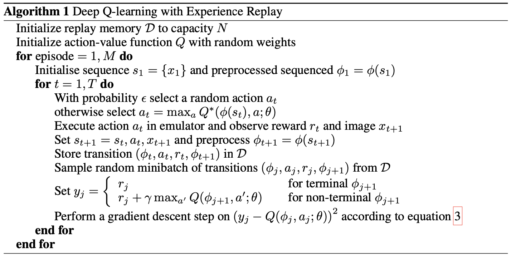

# Key Papers in RL #1: Playing Atari with Deep Reinforcement Learning

To kick of my series on key papers in reinforcement learning, I have decided to follow the list of papers as it appears on OpenAI's [documentation on the same topic](https://spinningup.openai.com/en/latest/spinningup/keypapers.html). Since there are over 100 papers listed, it makes sense to work through them over the course of a few months. The first section is Model-Free RL[^1] and the first subsection is Deep Q-Learning. 

## Paper Basics

The first paper in the series is a 2013 paper, [Playing Atari with Deep Reinforcement Learning](https://www.cs.toronto.edu/~vmnih/docs/dqn.pdf), by Mnih et al of Google's DeepMind. While this paper didn't introduce the concept of Deep Q-Networks, it's results illustrated the power that the concept could bring to bear. 

The main thrust of the paper is that it is a variant of Q-Learning, but instead uses stochastic gradient descent for weight updates and a experience replay buffer. The new algorithm was benchmarked on five Atari games using the [Atari Learning Environment](https://github.com/mgbellemare/Arcade-Learning-Environment#:~:text=The%20Arcade%20Learning%20Environment%20(ALE)%20is%20a%20simple%20object%2D,of%20emulation%20from%20agent%20design.); Pong, Breakout, Space Invaders, Seaquest, and Beam Rider.

The most similar algorithm according to the authors is an algorithm called neural-fitted Q-Learning (NFQ), which uses RPROP to update parameters of the Q-network. The major downside of NFQ is the use of batch update which is proportional to the size of the dataset, while SGD has a constant low-cost update.

## Algorithm and Network Architecture

The main algorithm used in this paper is as follows:


The network architecture takes an 84x84x4 image scaled from the original image from ALE in it's input layer. From there the architecture in PyTorch code:
```python
import torch.nn as nn

first_hidden_layer = nn.Conv2d(16, (8, 8), 4)
second_hidden_layer = nn.Conv2d(32, (4, 4), 2)
final_hidden_layer = nn.Linear(256, n_actions)
```

The network uses `ReLU` for each layer and `RMSProp` as the optimizer. Batch size for each update is `32`. 


[^1]: [Definition of Model-Free RL](https://spinningup.openai.com/en/latest/spinningup/rl_intro2.html)